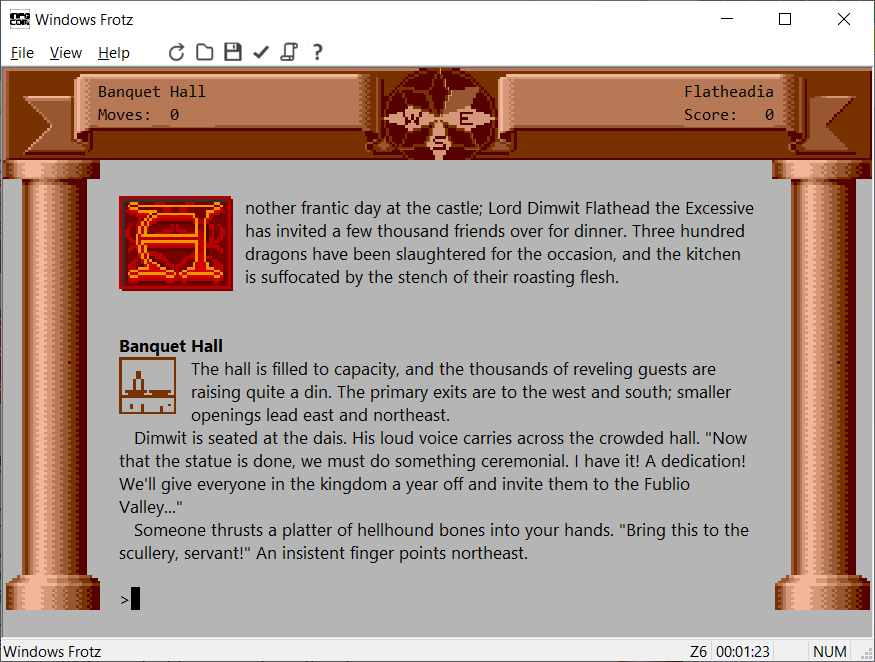

# Windows Frotz

Windows Frotz is an interpreter that can play all the old Infocom text adventures. Infocom used a novel approach to write their games: they had a system that produced a data file for the adventure that was the same on every computer, and an interpreter for every computer that could run all the games (It was actually a bit more complicated than that, but that's the basic idea).

During the late 1980s and early 1990s many people worked to decode Infocom's format, producing several interpreters for the format (which is called Z-code, or the Z-Machine, with the Z coming from Zork, Infocom's first game). Windows Frotz is the latest in this line of interpreters. During the early 1990s, Graham Nelson took the next step by writing a compiler for the format, called [Inform](https://www.inform-fiction.org/). The result is that the modern text adventure community have written several hundred games in this format that can be played with this interpreter.

For ratings and descriptions of games you can play, [search for Z-code games](https://ifdb.org/search?sortby=rcu&searchfor=format%3AZ-Machine*) at [IFDB](https://ifdb.org/).



## Building

Download and install Visual Studio 2019 Community edition from https://visualstudio.microsoft.com/. In the installer, under "Workloads", make sure that "Desktop development with C++" is selected, and under "Individual components" that "C++ MFC for latest build tools (x86 & x64)" is selected.

Install git. I use the version of git that is part of Cygwin, a Linux-like environment for Windows, but Git for Windows can be used from a Windows command prompt.

Open the environment that you are using git from (e.g. Cygwin), and switch to the root directory that the build environment will be created under (from here referred to as "\<root>"). Clone this and the other required repositories of mine with git:
```
git clone https://github.com/DavidKinder/Windows-Frotz.git Adv/Frotz
git clone https://github.com/DavidKinder/Libraries.git Libraries
```

### Third-party libraries

#### libpng

Download the latest version of zlib from https://zlib.net/. Unpack the archive and copy the contents of the top-level directory to "\<root>/Libraries/zlib".

Download the latest version of libpng from http://www.libpng.org/pub/png/libpng.html. Unpack the archive and copy the contents of the top-level directory to "\<root>/Libraries/libpng". Copy the file "\<root>/Libraries/libpng/scripts/pnglibconf.h.prebuilt" to "\<root>/Libraries/libpng/pnglibconf.h".

Open "\<root>/Libraries/libpng/pnglibconf.h" in a text editor, and find and delete all lines that define symbols starting with "PNG_SAVE_", "PNG_SIMPLIFIED_WRITE_" and "PNG_WRITE_".

#### libjpeg

Download libjpeg 6b from http://libjpeg.sourceforge.net/. (Later versions are available, but maintenance of libjpeg seems to have been taken up by someone other than the original authors, who has some distinctly odd ideas.)

Unpack the archive and copy the contents of the "jpeg-6b" directory to "\<root>/Libraries/jpeg". In "\<root>/Libraries/jpeg", rename "jconfig.vc" to "jconfig.h".

Open "\<root>/Libraries/jpeg/jmorecfg.h" in a text editor, and find
```
#ifndef XMD_H			/* X11/xmd.h correctly defines INT32 */
typedef long INT32;
#endif
```
Change it to
```
#if !defined(XMD_H) && !defined(_BASETSD_H_)
typedef long INT32;
#endif
```
In the same file, find
```
#ifdef NEED_FAR_POINTERS
#define FAR  far
#else
#define FAR
#endif
```
Change it to
```
#ifndef FAR
#ifdef NEED_FAR_POINTERS
#define FAR  far
#else
#define FAR
#endif
#endif
```

#### libvorbis

Download the latest stable versions of libogg and libvorbis from https://xiph.org/downloads/. Unpack the libogg archive and copy the contents of the top-level directory to "\<root>/Libraries/libogg". Unpack the libvorbis archive and copy the contents of the top-level directory to "\<root>/Libraries/libvorbis".

### Compiling the project

Start Visual Studio, open the solution "\<root>/Adv/Frotz/Win/Frotz.sln", then build and run the "Frotz" project.
