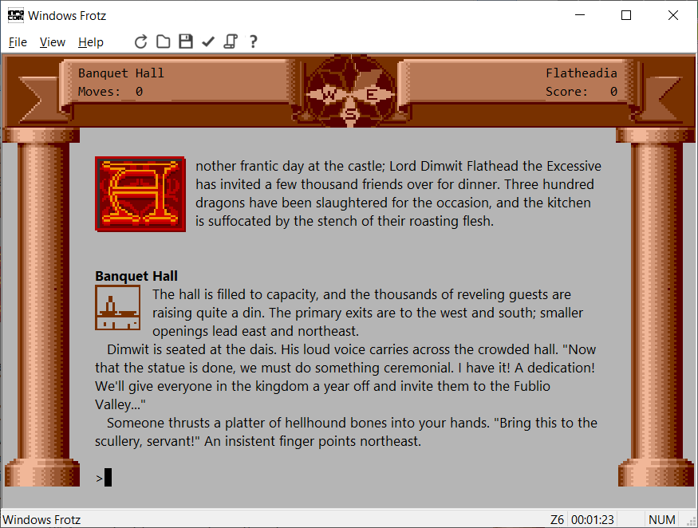

# Windows Frotz

Windows Frotz is an interpreter that can play all the old Infocom text adventures. Infocom used a novel approach to write their games: they had a system that produced a data file for the adventure that was the same on every computer, and an interpreter for every computer that could run all the games (It was actually a bit more complicated than that, but that's the basic idea).

During the late 1980s and early 1990s many people worked to decode Infocom's format, producing several interpreters for the format (which is called Z-code, or the Z-Machine, with the Z coming from Zork, Infocom's first game). Windows Frotz is the latest in this line of interpreters. During the early 1990s, Graham Nelson took the next step by writing a compiler for the format, called [Inform](https://www.inform-fiction.org/). The result is that the modern text adventure community have written several hundred games in this format that can be played with this interpreter.

For ratings and descriptions of games you can play, [search for Z-code games](https://ifdb.org/search?sortby=rcu&searchfor=format%3AZ-Machine*) at [IFDB](https://ifdb.org/).



## Building

Download and install Visual Studio Community edition from https://visualstudio.microsoft.com/. In the installer, under "Workloads", make sure that "Desktop development with C++" is selected, and under "Individual components" that "C++ MFC for x64/x86 (Latest MSVC)" is selected.

Install git. I use the version of git that is part of MSYS2, a Linux-like environment for Windows, but Git for Windows can be used from a Windows command prompt.

Open the environment that you are using git from, and switch to the root directory that the build environment will be created under (from here referred to as "\<root>"). Clone this and the other required repositories of mine with git:
```
git clone https://github.com/DavidKinder/Windows-Frotz.git Adv/Frotz
git clone https://github.com/DavidKinder/Libraries.git Libraries
```

### Third-party libraries

#### libpng

Download the latest version of zlib from https://zlib.net/. Unpack the archive and copy the contents of the top-level directory to "\<root>/Libraries/zlib".

Download the latest version of libpng from http://www.libpng.org/pub/png/libpng.html. Unpack the archive and copy the contents of the top-level directory to "\<root>/Libraries/libpng". Copy the file "\<root>/Libraries/libpng/scripts/pnglibconf.h.prebuilt" to "\<root>/Libraries/libpng/pnglibconf.h".

Open "\<root>/Libraries/libpng/pnglibconf.h" in a text editor, and find and delete all lines that define symbols starting with "PNG_SAVE_", "PNG_SIMPLIFIED_WRITE_" and "PNG_WRITE_".

#### libjpeg-turbo

Download the latest release of libjpeg-turbo from https://github.com/libjpeg-turbo/libjpeg-turbo/releases/. The file required is the Windows 32-bit build, which will be named "libjpeg-turbo-N-vc-x86.exe", where N is the version number.

Unpack the archive and copy the contents of the top-level directory directory to "\<root>/Libraries/jpeg". Rename the "lib" directory to "lib32".

#### libvorbis

Download the latest stable versions of libogg and libvorbis from https://xiph.org/downloads/. Unpack the libogg archive and copy the contents of the top-level directory to "\<root>/Libraries/libogg". Unpack the libvorbis archive and copy the contents of the top-level directory to "\<root>/Libraries/libvorbis".

### Compiling the project

Start Visual Studio, open the solution "\<root>/Adv/Frotz/Win/Frotz.sln", then build and run the "Frotz" project.
